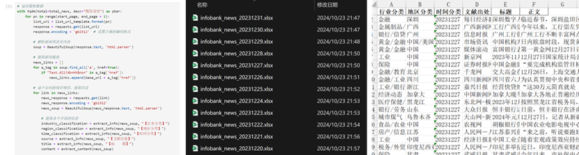
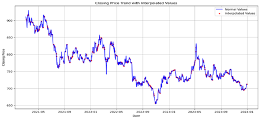
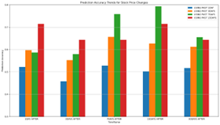
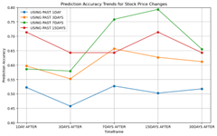
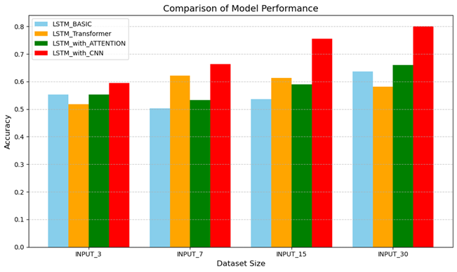
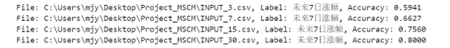
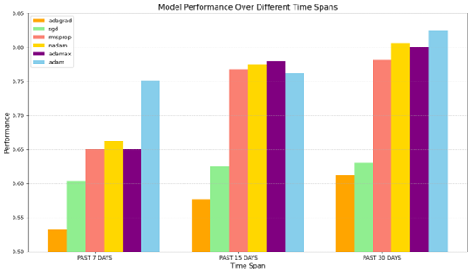
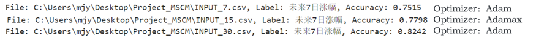
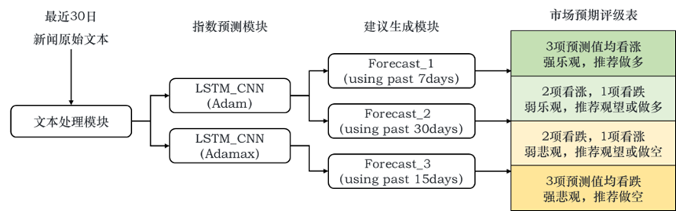

2024 人工智能 大作业实验报告

基于金融媒体情绪的资本市场预测模型

马际元 2022200057 金融科技实验班

一、选题背景综述

金融市场中，投资者的决策常常受到情绪因素的影响。

随着信息技术的迅猛发展，新闻媒体成为了影响市场情绪的重要来源。已有研究表明，新闻媒体情绪与短期市场波动之间存在显著关联。本研究的创新之处就在于结合深度学习技术，捕捉其关联机制并实现指数的预测。

本项目的研究重点是探索新闻情绪对股票市场价格波动的潜在影响，并构建一个基于金融媒体文本情绪的资本市场预测系统。具体而言，聚焦于银行业这一特定板块，通过分析新闻报道中的情绪信息，结合银行业资本市场指数，利用深度学习技术，开发出能够预测未来市场涨跌的模型。此研究有助于揭示情绪因素在金融市场中的作用，也能投资者提供一种新的分析工具，以提高决策的准确性。

模型设计部分主要思路如下：

二、数据收集

我使用的新闻文本语料来自 Infobank 中国经济新闻库，该数据库是全球最大的中文财经数据库之一，数据源包括国内外超过1500家媒体的公开信息。此外，该数据库每日更新，提供了很高频率的数据，便于研究。

设置关键词“银行”，利用爬虫技术将其新闻标题、行业分类、新闻正文等关键信息抓取下来。由于数据库访问有限，我最终构建的语料库包括 2021年1月1日 - 2024年1月1日间的全部新闻文本，共十万余条。

除此之外，我下载了同时期内“上证银行股指数”历史数据。该指数以上证全指中所有银行行业证券作为指数样本，代表沪深市场银行证券的整体表现，能够反映银行业整体的市场表现和行业景气度。

三、数据处理

针对新闻文本数据，参考 Jiang et al. 2019文献中所构建的中文金融情感词典，共5890个负向词和3338个正向词，将文本对该词典进行映射，选出总出现频次超过10的47个负向词和146个正向词作为文本数据集的特征。

分别以1日、3日、7日、15日、30日为单位，统计词汇出现的词数，构建特征：n1,n2,n3,…,n47,p1,p2,p3,…,p146，划分为五个文件。

以下为新闻文本语料中出现的正向词与负向词词云图：

 

针对指标数据，首先通过移动平均的方法将时间周期内的空缺值补充完整；对每一天的数据，计算其未来1日、3日、7日、15日、30日的涨跌情况，以标签1/0进行标记。 将二者整合，得到数据集。

图中红色点即为通过空值填充的结果。

四、机制探究

由于媒体情绪对资本市场情绪的影响具有持续性和滞后性，因此选择以 [ 1, 3, 7, 15 ] 天为时间窗口长度，分别预测未来滞后 [ 1, 3, 7, 15, 30 ] 天指数的涨跌情况。

基于 SVM 模型，预测结果如下图所示。

 

结果显示，除时间长度为 1 的预测结果在 50% 左右浮动，其它参数选择均显著高于 50%，证明方法选择的有效性；预测准确率随时间窗口长度增长有上升趋势，随滞后度的增长有先上升后下降的趋势，符合预期。

五、模型择优与优化

选择滞后度为7，时间窗口为 [ 3, 7, 15, 30 ] ，我尝试构建了以下四种模型架构，比较其预测能力。

* LSTM\_BASIC

LSTM基础模型用于二元分类任务，主要通过LSTM层处理序列数据。模型包含两层LSTM，第一层有64个单元并返回完整序列，第二层有32个单元并返回最后一个时间步的输出。每层LSTM后均加入Dropout层（30%）以减少过拟合。输出层为一个使用Sigmoid激活函数的全连接层，将输出值压缩到0和1之间，适合二元分类。模型通过Adam优化器和二元交叉熵损失函数进行编译，并以准确率作为评估指标。该模型擅长捕捉序列数据的时间依赖性，适用于处理时间序列、文本分类等任务。

* LSTM\_TRANSFORMER

此模型结合了LSTM和Transformer架构，以处理复杂序列数据。LSTM层提取时间依赖特征，随后通过多个Transformer Encoder块增强全局特征建模能力。Encoder块包含多头自注意力机制、残差连接、层归一化和前馈网络，能捕捉序列中长距离依赖关系。全局平均池化层进一步压缩序列特征，Dropout正则化减少过拟合。输出层为Sigmoid激活的全连接层，用于生成分类概率。模型通过Adam优化器和二元交叉熵损失函数编译，适合长序列的分类任务，如文本分析和时间序列预测。

* LSTM\_WITH\_ATTENTION

此模型在LSTM架构中引入注意力机制，提升对关键时间步的捕捉能力。模型包含三层LSTM，前两层返回完整序列，最后一层返回最终时间步输出。注意力层通过query、key和value机制捕捉全局上下文信息，并将其与LSTM输出拼接。Dropout层在每个关键步骤后应用以减少过拟合。最终的全连接层使用Sigmoid激活函数输出分类概率。该模型结合了LSTM的时间依赖建模能力和注意力机制的全局特征捕捉能力，适用于情感分析、异常检测等任务。

* LSTM\_CNN

该模型结合CNN和LSTM的优点，同时引入注意力机制处理序列分类任务。CNN部分通过卷积和池化提取局部特征，LSTM部分捕捉时间依赖关系。注意力机制帮助模型关注重要时间步，提升对关键特征的捕捉能力。最终通过全连接层完成分类任务。模型使用Dropout正则化减少过拟合，并通过Adam优化器和二元交叉熵损失函数进行编译。结合局部特征提取、时间建模和全局上下文捕捉能力，该模型适用于文本分类、时间序列分析和信号处理等领域。

四种模型训练预测结果如下图所示。对比发现，基础LSTM在引入注意力机制后，在各时间窗口下的预测准确率均有小幅度上升；基础LSTM结合Transformer之后，只在部分情况下对准确率有所改善。

综合表现最好的模型是LSTM与CNN相结合的架构。

通过参数的调整和择优，最终使用的LSTM\_CNN模型，能够在时间窗口为15的数据集中得到75.6%的准确率；在时间窗口为30的数据集中得到80.0%的准确率，表现优秀,因此将该模型作为首选模型。

基于 LSTM\_CNN 模型，进一步探索不同优化器的选择对模型预测能力的影响。以 [ 7, 15, 30 ]为时间窗口，横向比较使用Adam、SGD、Rmsprop、Adagrad、Nadam和Adamax六种优化器下模型的预测准确率。

分析结果发现，Adagrad与SGD在该任务上的表现不佳，而其余优化器均有不错的表现结果。时间窗口为7时，Adam优化器的优化效果尤为突出；时间窗口为15与30时，四类优化器的优化水平基本持平。Adamax能够将窗口15的准确率提升至77.9%，Adam则可以将窗口30的准确率提升至82.4%。基于此，在实际应用中即可通过分析需求的不同选择合适的优化器进行模型的编译。

在各个时间窗口下的最佳准确率如下所示：

六、一体化设计

基于模型与优化器的择优和确定，我设计了以下组织架构，以实现从原始文本到做出市场预测、给出投资决策参考的智能系统。将文本处理模块、指数预测模块、建议生成模块进行封装，以满足面向对象的需求。

用户只需要向系统提供相关行业过去30天内的新闻文本数据，系统就能通过上述智能分析过程，直接给出未来市场预期评级和投资建议。

七、研究总结

我的本次大作业项目主要工作总结如下：

* 通过分析新闻报道中的情绪信息，以银行业为代表，基于支持向量机模型，验证了新闻情绪对资本市场行业指数波动的显著影响，为投资者提供了新的视角来理解市场动态。
* 基于LSTM与Transformer、CNN等多种深度学习模型的组合构建，实现了新闻媒体情绪对资本市场行业指数波动的粗略预测，为量化投资决策提供了新的参考来源。
* 横向对比多种模型架构与多类优化器的在该模型下的优化水平，综合构建出一个整体表现较为良好的市场情绪预测系统，可以作为行业分析与行业投资的辅助工具。

以下是本次项目的不足与未来潜在改进空间：

* 数据集总量与选取：由于数据库访问受限，数据量相对不够充足；与此同时，选取的时间区间内行业指数的总体有一定的下降趋势，导致预测的难度降低，整体准确率偏高。后续考虑增加数据量、选取整体趋势不明显的区间或其他行业，以提高模型稳健性。
* 技术新颖性：情绪分析部分，词典法虽然广泛使用但并不新颖，可以考虑结合BERT等自然语言模型更准确地捕捉特征；深度学习部分，可以考虑选用更多新颖的模型，如TCN、GRU等。